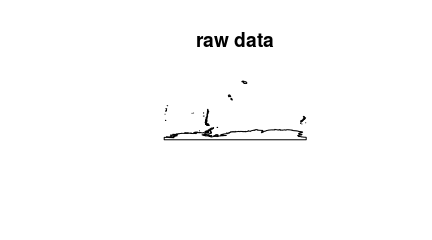
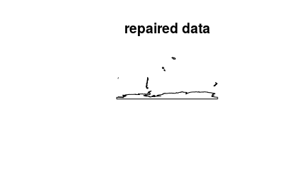

<!--- README.md is generated from README.Rmd. Please edit that file -->
prepairr: Interface to prepair
------------------------------

[](https://www.tidyverse.org/lifecycle/#experimental)

### Overview

The *prepairr R* package provides an interface to the [*prepair* tool](https://github.com/tudelft3d/prepair) for repairing invalid polygon geometries (Ledoux, Arroyo Ohori & Meijers, 2014). This project was developed as an experiment to benchmark the performance of the *prepair* tool for repairing invalid geometries in large spatial datasets. Unfortunately, this package is actually **slower** than standard geometry cleaning tools (such as the [*lwgeom R package*](%5B_lwgeom%20R_%20package%5D(https://CRAN.R-project.org/package=lwgeom)). As a consequence, this package is unlikely to receive further development.

### Installation

The developmental version of the *prepairr R* package can be installed using the following R code. Please note that this package will only work on Unix systems and requires the [*sf R*](https://github.com/r-spatial/sf) package which requires additional software to be installed. If you encounter problems installing the *prepairr R* package, please consult the installation instructions for the [*sf R*](https://github.com/r-spatial/sf) package.

``` r
if (!require(remotes))
  remotes::install_github("jeffreyhanson/prepairr")
```

### Usage

Here we will explore the usage and (substandard) performance of this package. To achieve this, we will first load the *prepair* package. We will also load two other packages for working with spatial vector data.

``` r
# load packages
library(prepairr)
library(sf)
library(lwgeom)
```

    ## Linking to liblwgeom 2.5.0dev r16016, GEOS 3.5.1, PROJ 4.9.2

``` r
library(rworldxtra)
```

    ## Loading required package: sp

Next, we will obtain a small spatial dataset containing invalid geometries. Specifically, we will import data delineating the country boundaries (originally from [Natural Earth](https://www.naturalearthdata.com/)).

``` r
# import data, subset data to reduce total run time, and convert to sf format
data(countriesHigh, package = "rworldxtra")
x <- as(countriesHigh[c(12, 41, 132), "ADMIN"], "sf")

# preview data
print(x)
```

    ## Simple feature collection with 3 features and 1 field
    ## geometry type:  MULTIPOLYGON
    ## dimension:      XY
    ## bbox:           xmin: -179.999 ymin: -89.99983 xmax: 180 ymax: 8.565396
    ## epsg (SRID):    4326
    ## proj4string:    +proj=longlat +datum=WGS84 +no_defs
    ##          ADMIN                       geometry
    ## 12  Antarctica MULTIPOLYGON (((-61.03006 -...
    ## 41       Chile MULTIPOLYGON (((-69.47578 -...
    ## 132    Liberia MULTIPOLYGON (((-9.433115 7...

``` r
# plot data
plot(st_geometry(x), main = "raw data")
```



``` r
# verify that the dataset has invalid geometries
all(suppressWarnings(st_is_valid(x)))
```

    ## [1] FALSE

Now we will repair the data using the [*prepair* tool](https://github.com/tudelft3d/prepair). We will also record how long it takes to repair the data so we can compare it with standard data cleaning tools later.

``` r
# repair geometries using prepair and record processing time
prepair_time <- system.time({
  y <- st_prepair(x)
})[[3]]

# preview cleaned data
print(y)
```

    ## Simple feature collection with 3 features and 1 field
    ## geometry type:  GEOMETRY
    ## dimension:      XY
    ## bbox:           xmin: -179.999 ymin: -89.99983 xmax: 180 ymax: 8.565396
    ## epsg (SRID):    4326
    ## proj4string:    +proj=longlat +datum=WGS84 +no_defs
    ##          ADMIN                       geometry
    ## 12  Antarctica MULTIPOLYGON (((-52.51818 -...
    ## 41       Chile MULTIPOLYGON (((-68.63828 -...
    ## 132    Liberia POLYGON ((-9.433114 7.99331...

``` r
# verify that all geometries are now valid
all(st_is_valid(y))
```

    ## [1] FALSE

``` r
# print processing time (seconds)
print(prepair_time)
```

    ## [1] 8.364

``` r
# plot repaired data
plot(st_geometry(y), main = "repaired data")
```



Next we will repair the data using the [*lwgeom R* package](https://CRAN.R-project.org/package=lwgeom) and record how long this tool takes to repair the data.

``` r
# repair geometries using lwgeom and record processing time
lwgeom_time <- system.time({
  z <- st_make_valid(x)
})[[3]]

# preview cleaned data
print(z)
```

    ## Simple feature collection with 3 features and 1 field
    ## geometry type:  MULTIPOLYGON
    ## dimension:      XY
    ## bbox:           xmin: -179.999 ymin: -89.99983 xmax: 180 ymax: 8.565396
    ## epsg (SRID):    4326
    ## proj4string:    +proj=longlat +datum=WGS84 +no_defs
    ##          ADMIN                       geometry
    ## 12  Antarctica MULTIPOLYGON (((167.1133 -7...
    ## 41       Chile MULTIPOLYGON (((-67.49094 -...
    ## 132    Liberia MULTIPOLYGON (((-9.433115 7...

``` r
# verify that all geometries are now valid
all(st_is_valid(z))
```

    ## [1] TRUE

``` r
# print processing time (seconds)
print(lwgeom_time)
```

    ## [1] 1.789

As we can see, the `st_prepair` function in this package took 6.575 seconds longer to complete. Therefore, do not use this package to clean your data.

### References

[Ledoux H, Arroyo Ohori K, and Meijers M (2014) A triangulation-based approach to automatically repair GIS polygons. Computers & Geosciences 66:121--131](https://doi.org/10.1016/j.cageo.2014.01.009).

### Citation

This is an experimental package. You should not be citing this package because you should not be using it for any reason at all.
